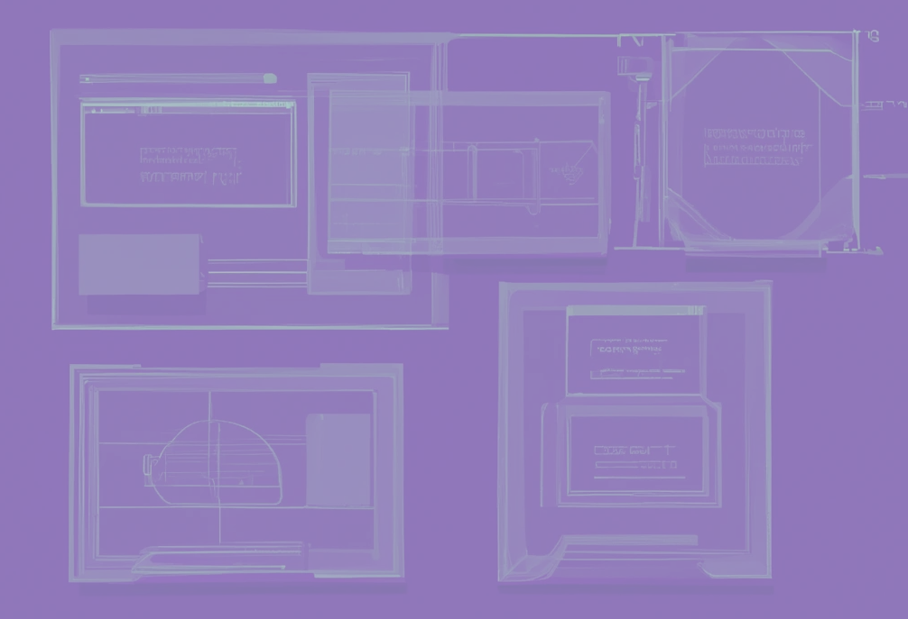

## ICU On Cloud
- Description:
  - Designed the SAAS model for ICU healthcare data, streamlining management and integration processes on the cloud.
  - Orchestrated seamless integration of healthcare data, optimizing accessibility and ensuring efficient utilization for ICU operations.
  - Currently exploring AI-driven analytics to enhance predictive capabilities and improve decision-making within the healthcare data management system.

- 
- Tags: CuraSigna
- Badges:
  - Badge [blue]
- Buttons:
  - Check it out on NASA's Site [https://spinoff.nasa.gov/NASA%E2%80%99s-VITAL-Contribution-to-Global-Pandemic-Relief]

## Share and Debenture Management System 
- Description:
  - Led the development of CuraSigna's Share and Debenture Management System using ReactJS, NodeJS, Express, and MongoDB ensuring a seamless and engaging user experience.
  - Implemented robust authentication checks and data hashing, reinforcing system security in compliance with industry standards.

- 
- Tags: CuraSigna
- Badges:
  - ReactJS [purple]
  - NodeJS [purple]
  - Express [purple]
  - MongoDB [purple]
- Buttons:

## Demand Forecasting Model
- Description:
  - Developed a demand forecasting model for Unilever's consumer goods in France and Egypt, utilizing Python, Numpy, Pandas, Scikit-learn, Pytorch Tabular, and Matplotlib.
  - Extracted and transformed time series data into about 180 attributes, achieving an 80% accurate rolling 2-year forecast for individual retailers. Improved accuracy by 5%, translating to multi-million-dollar business impact.

- 
- Tags: Unilever
- Badges:
  - Badge [blue]
- Buttons:
 

## Blockchain-Based Electronic Health Record (EHR) Framework
- Description:
  - Identified common issues in the country's medical services, including challenges with doctors' referral processes, data transfer between health institutions, and patient portal accessibility.
  - Developed a comprehensive Electronic Health Record (EHR) Framework on Blockchain, addressing issues like data privacy, accessibility, and interoperability. 

- 
- Tags: VTU
- Badges:
  - Badge [blue]
- Buttons:
  - Check it out the Published Paper [https://doi.org/10.1109/ICCCI50826.2021.9402689]
  
 