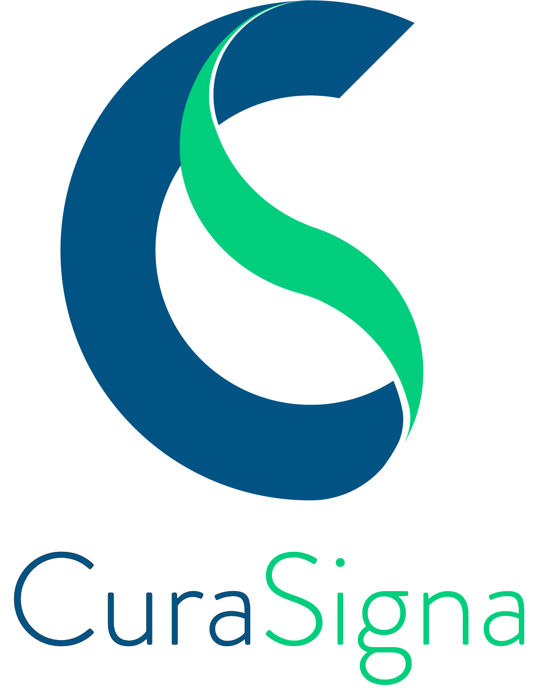
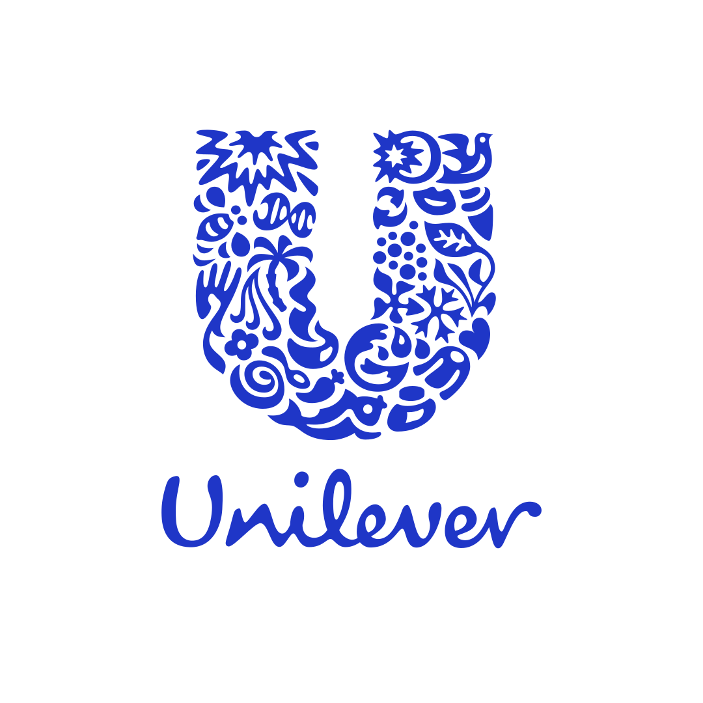

## CuraSigna Systems Pvt. Ltd.
- *Software Engineer* | Apr'20 - Curr
- 
- Tags: 2020-Current
- Badges:
  - Badge [blue]
- List Items:
  - Worked on a proposal to NASA’s Jet Propulsion Lab and won the company licensing for the manufacture of the VITAL ventilator during COVID.
  - Developed a Share and Debenture management system using ReactJS, NodeJS, Express and MongoDB.

## Unilever Industries Pvt. Ltd.
- *Data Scientist* | Jan'19 - Jun'19
- 
- Tags: 2019
- Badges:
  - Badge [blue]
- List Items:
  - Point 1
  - Point 2

## GOCheck Media Pvt. Ltd.
- *Intern* | July'18 - Dec'18
- 
- Tags: 2018
- Badges:
  - Badge [blue]
- List Items:
  - Point 1
  - Point 2