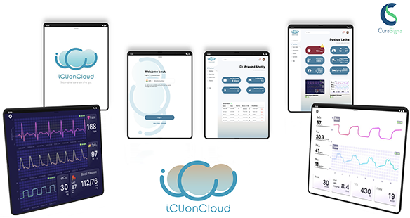
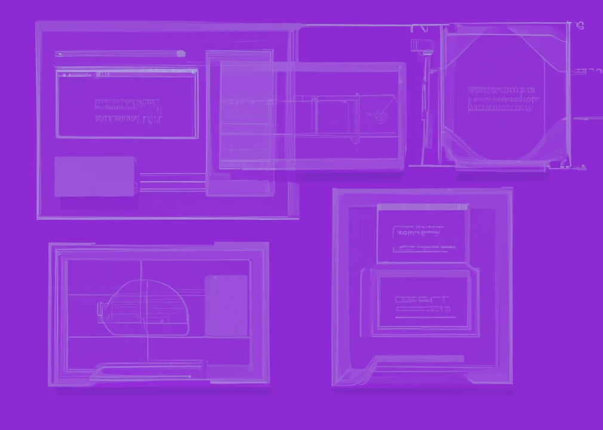

## ICU On Cloud
- Description:
  - Designed the SAAS model for ICU healthcare data, streamlining management and integration processes on the cloud.
  - Orchestrated seamless integration of healthcare data, optimizing accessibility and ensuring efficient utilization for ICU operations.
  - Currently exploring AI-driven analytics to enhance predictive capabilities and improve decision-making within the healthcare data management system.

- 
- Tags: Category 2
- Badges:
  - Badge [blue]
- Buttons:
  - Check it out on NASA's Site [https://spinoff.nasa.gov/NASA%E2%80%99s-VITAL-Contribution-to-Global-Pandemic-Relief]

## Share and Debenture Management System 
- Description:
  - Led the development of CuraSigna's Share and Debenture Management System using ReactJS, NodeJS, Express, and MongoDB ensuring a seamless and engaging user experience.
  - Implemented robust authentication checks and data hashing, reinforcing system security in compliance with industry standards.

- 
- Tags: CuraSigna
- Badges:
  - ReactJS [purple]
  - NodeJS [purple]
  - Express [purple]
  - MongoDB [purple]
- Buttons:

## Project C
- Description:
  - Line 1

- 
- Tags: Category 3
- Badges:
  - Badge [blue]
- Buttons:
  - Link [https://example.com]